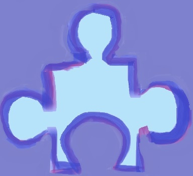
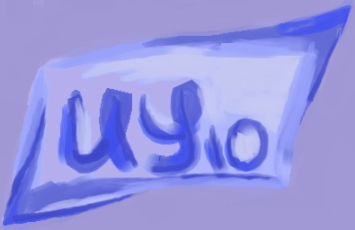

# site
<!DOCTYPE html>
<html lang="en">
<head>
    <meta charset="UTF-8">
    <link rel="stylesheet" href="project.css">
    <link href="https://fonts.googleapis.com/css2?family=Playfair+Display:wght@400;600&display=swap" rel="stylesheet">
    <link href="https://fonts.googleapis.com/css2?family=Roboto:wght@300&display=swap" rel="stylesheet">
    <link rel="stylesheet" href="https://maxcdn.bootstrapcdn.com/bootstrap/4.0.0/css/bootstrap.min.css" integrity="sha384-Gn5384xqQ1aoWXA+058RXPxPg6fy4IWvTNh0E263XmFcJlSAwiGgFAW/dAiS6JXm" crossorigin="anonymous">
    <title>Title</title>
</head>
<body>

<header class="font1">
    

        <input type="checkbox" id="side-checkbox" />
        

            <label class="side-button-2" for="side-checkbox">+</label>
            
WebArt

            <label for="side-checkbox">home</label> 
            <label for="side-checkbox">shop</label> 
            <label for="side-checkbox">contact</label> 
            <label for="side-checkbox">about us</label>
        

        

            <label class="side-button-1" for="side-checkbox">
                

                    

                        
                    

                

            </label>
        

    

    <a href="#logo" class="logo">WebArt</a>
    <nav>
        <a class="active" href="#home">home</a>
        <a href="#shop">shop</a>
        <a href="#contact">contact</a>
        <a href="#about">about us</a>
    </nav>
</header>

    <input class="search" type="text" placeholder="search...">
    

        

            

                

                    paintings
                

                

                    documents
                

                

                    interesting
                

                

                    news
                

            

        

    

        

            

                

                    

                            

                                
                                  
                                

                                    <button class="bn"><a href="#" style="color: black;">learn more..</a></button>
                                

                            

                    

                    

                            

                                
                                                      
                                

                                    <button class="bn" style="bottom: 5vh"><a href="#" style="color: black;">learn more..</a></button>
                                

                            

                    

                    

                            

                                
                                                  
                                

                                    <button class="bn"><a href="#" style="color: black;">learn more..</a></button>
                                

                            

                    

                

            

        

    

            

                
                <button class="bn_1"><a href="#" style="color: black;">learn more..</a></button>
            

            

                
                <button class="bn_1"><a href="#" style="color: black;">learn more..</a></button>
            

            

                
                <button class="bn_1"><a href="#" style="color: black;">learn more..</a></button>
            

    

    

        

            

                

                    

                        

                            

                            

                        

                    

                    

                        

                            

                            

                        

                    

                    

                        

                            

                                
                            

                        

                    

            

                

                    

                        

                            <button class="download_b" style="left: 5vw;">Learn more...</button>
                        

                        

                            <button class="download_b" style="left: 40vw">Learn more...</button>
                        

                        

                            <button onclick="change_image.src='./assets/down.jpg'" class="download_b">Learn more...</button>
                        

                    

                

            

                

            

        

    

    

        
    

    

        
Искусство — форма творчества, способ духовной

 самореализации человека посредством

 чувственно-выразительных средств 

(звука, пластики тела, рисунка, слова,

 цвета, света, природного материала и т.д.)

    

<footer>
    

        

            

                

                    
                

                

                    
<a href="#.html" class="text">+7(999)-999-99-99</a>

                    
                

                

                    
<a href="#vk.html" class="text" >vk.com</a>

                    
                

                

                    
<a href="#inst.html" class="text" style="margin-right: 5vw;">@inst</a>

                    
                

            

        

    

</footer>
<footer class="container-2">
    
    

        
        
        
    

</footer>

</body>
</html>
